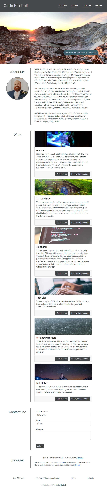

# Professional Portfolio - Chris Kimball

## Contributors
---------------
[Chris Kimball](https://github.com/chirskimball "chirskimball's GitHub Profile")

## Description
---------------
The following project is a professional portfolio for Chris Kimball. 

This portfolio is designed to show potential employers the skills and talents of Chris Kimball to fill a part-time or full-time position as a web developer.  

The portfolio currently has links to 6  projects will be updated as Chris develops and deploys new projects through the course of his Full Stack Flex Bootcamp.

Upon launching the webpage users will be presented with navigation bar at the top of the page, with navigational links to four sections of the portfolio, 'About me', 'Work', 'Contact Me', and 'Resume'.

If the user hovers their cursor over the navigation links, the links will pop out to indicating the link that would be selected if clicked. If one of the navigation links is clicked the page will re-render only the section that was clicked. If the user click's Chris Kimball's name in the navbar it will re-render all sections of the portfolio.

Below the header and navigation bar, the user is presented with a banner image of a mountain landscape (photo captured by Chris Kimball), and will be presented with a message if their cursor is hovered over the banner image.

The main content area of the webpage contains the four sections with an about me section with a short bio on Chris Kimball and a picture next to it in the heading area. Below the about me section in the work section there are examples of deployed projects. Each project will have a short description and buttons to the Github repository and Deployed Application.

Below the work section is the contact me section, which contains contact form which allows potential employers and collaborators enter their email, name and a message. Currently since there is no back end for this project the contact form does not actually function as intended, it is just a placeholder for future improvements.

The final section of the portfolio is the Resume section containing a link to Chris' Resume and links to his LinkedIn and Github profiles.

The footer contains contact information to reach out directly to Chris Kimball.

This whole portfolio page has been designed with a wide variety of display resolutions and devices in mind. All of the elements will dynamically resize themselves if the browser window is scaled up or down, or if the user is visiting the page on a mobile device.

## Table of Contents
---------------
* [Web Addresses](#web-addresses)
* [License](#license)
* [Technology Used](#technology-used)
* [Screenshots](#screenshots)
* [Image Credits](#image-credits)
* [Questions](#questions)

## Web Addresses
---------------
*  [Github Repository](https://github.com/chriskimball/chriskimball.github.io "Github Repo")
*  [Deployed Application on Github Pages](https://chriskimball.github.io/ "Deployed Application on Github Pages")

## License
---------------
This project is licensed under the MIT license.

## Technology Used
---------------
* HTML/CSS
* JavaScript
* React.js
* gh-pages npm package

## Screenshots
---------------
#### PC display 1920 pixel width

#### PC display 944 pixel width

#### iPad display 768 pixel width

#### iPhone display 375 pixel width

## Image Credits
---------------
* https://raw.githubusercontent.com/chriskimball/gameRec/main/public/images/banner-image.jpeg
* https://images.unsplash.com/photo-1462759353907-b2ea5ebd72e7?ixlib=rb-1.2.1&ixid=MnwxMjA3fDB8MHxwaG90by1wYWdlfHx8fGVufDB8fHx8&auto=format&fit=crop&w=1631&q=80
* https://images.unsplash.com/photo-1508921108053-9f757ead871c?ixlib=rb-1.2.1&ixid=MnwxMjA3fDB8MHxwaG90by1wYWdlfHx8fGVufDB8fHx8&auto=format&fit=crop&w=1170&q=80
* https://images.unsplash.com/photo-1486312338219-ce68d2c6f44d?ixlib=rb-1.2.1&ixid=MnwxMjA3fDB8MHxwaG90by1wYWdlfHx8fGVufDB8fHx8&auto=format&fit=crop&w=1172&q=80
* https://i.giphy.com/media/xTcnThWTvBZGrgx2dW/giphy.webp
* https://i.giphy.com/media/KDrjub26iceZ2/giphy.webp

## Questions
---------------
If you have any questions about the repo, open an issue or contact me directly at [chriskimball.dev@gmail.com](mailto:chriskimball.dev@gmail.com). You can find more of my work at [chirskimball](https://github.com/chirskimball "chirskimball's GitHub Profile").

## Copyright Info
---------------
© 2022 Chris Kimball